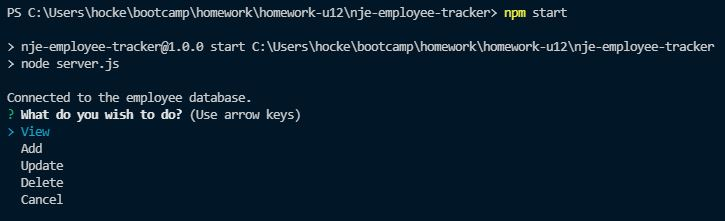

# Employee Tracker Database

# Table of Contents
[Description](#description) - 
[Install](#install) - 
[Usage](#usage) - 
[Technologies](#technologies) -
[Links](#links) - 
[Contact](#contact) - 
[License](#license)

## Description
This program is a employee tracking database that has full functionality through command lines. Allowing the user to create different departents, roles, and employees. And then view or track through different options in the menus. The application also allows the user to update an employee's role or manager, to keep the information up to date. As well as delete different departments, roles, or employees, allowing the data to be current to what their businesss is at the current moment. This application does come with some default data that can be used to seed the database. 

## Install
Please use **'npm i'** in the command line to install the dependencies. This program uses Inquirer, mysql2, console.table, and dotenv.
Before you begin please also update the **'.env.EXAMPLE'** file to include your information for SQL. Then rename the file to **'.env'**. Without this step the program will not run. 

## Usage
To use this program please run the **'schema.sql'** file in the db directory, as well as the **'seeds.sql'** if you would like to have the database seeded. Otherwise you will have to use the application to add your own departments, roles, and employees. When ready use **'npm start'** into the command line to run, when this is done you will be prompted with the first question.

## Technologies

## Links
 
 
[Walkthrough Video](https://youtu.be/Kc4LoSVHORo)  
[GitHub](https://github.com/niklasertle/nje-employee-tracker)

## Contact
[GitHub Profile](https://github.com/niklasertle) 
Email: nik.ertle@gmail.com

## License
[MIT License Copyright (c) 2021 niklasertle](LICENSE)